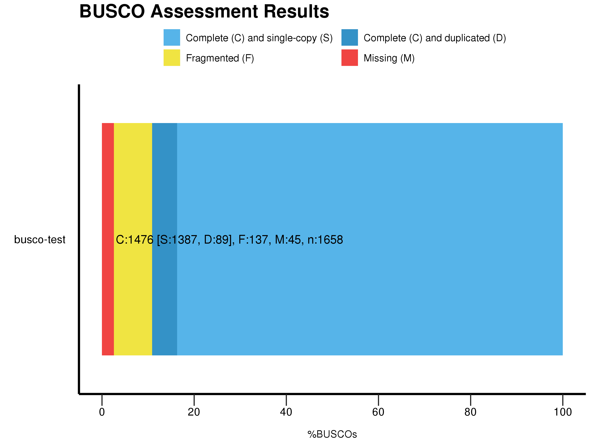

# Pipeline for wireworm genome assembly & RADseq genotyping

Analyses implemented in the following manuscript:

Andrews KR, A Gerritsen, A Rashed, D Crowder, SI Rondon, WG van Herk, R Vernon, KW Wanner, CM Wilson, DD New, MW Fagnan, PA Hohenlohe, SS Hunter. Genomic analysis of three wireworm (Coleoptera: Elateridae) species reveals putative cryptic species, population structure, and adaptive responses to agricultural pest control. *In review*.

## Requirements

* MaSuRCA v3.2.4
* BUSCO v3.0.2
* HTStream
* STACKS v2.3e
* BWA v0.7.17
* GATK v4.1.1.0
* VCFTools v0.1.15

## Genome assembly

#### 1. Assembly of *Limonius californicus* genome from Illumina, SLR, and PacBio reads

##### Install Masurca:
```
cd ~/MaSuRCA-hybrid-assembly
mkdir masurca
cd masurca
wget ftp://ftp.genome.umd.edu/pub/MaSuRCA/latest/MaSuRCA-3.2.4.tar.gz
tar xvf MaSuRCA-3.2.4.tar.gz
./install.sh
```

##### PacBio data was converted from fastq to fasta format and combined with Illumina SLR (synthetic long read) data and provided to MaSuRCA as a single file:
PACBIO=./pacbio+SLR_for_Masurca/combined.fa

##### Setup MaSuRCA assembly
```
cd ~/MaSuRCA-hybrid-assembly

mkdir 01-MaSuRCA-assembly
cd 01-MaSuRCA-assembly
cp ../masurca/MaSuRCA-3.2.4/sr_config_example.txt sr_config.txt

#Edit sr_config.txt to add Illumina and long read data. See MaSuRCA/sr_config.txt for final MaSuRCA config file.


../masurca/MaSuRCA-3.2.4/bin/masurca sr_config.txt
```


##### 2. Assessment of genome completeness

Installation of Busco is beyond the scope of this document, but the exact version of Busco used can be obtained by doing the following:
```
git clone https://gitlab.com/ezlab/busco.git
cd busco
git checkout 3927d240f8b5bf8232066d51fce4ac7554bf29a6
```

The database used was downloaded with the following command:
```
wget http://busco.ezlab.org/datasets/insecta_odb9.tar.gz
```

###### Run busco
```
cd ~/MaSuRCA-hybrid-assembly
module load python
module load ncbi-blast
module load hmmer
module load R/3.5.0

mkdir 02-Busco

export AUGUSTUS_CONFIG_PATH=~/opt/src/augustus/augustus-3.3.1/config

run_BUSCO.py -i ../01-MaSuRCA-assembly/CA.mr.41.15.17.0.029/final.genome.scf.fasta \
  -c 1 -m geno -l ~/databases/busco/insecta_odb9 -o busco-test

generate_plot.py -wd ./
```
{:height="50%" width="50%"}


## RADseq genotyping

Raw fastq.gz files are located in ```./00-RawData```

#### 1. Trim adapters using HTStream

```
mkdir 01-hts_AdapterTrimmed
```

Example command:

```
hts_AdapterTrimmer -m 50 -1 ./00-RawData/CAGATCAT_S178_L008_R1_001.fastq.gz -2 ./00-RawData/CAGATCAT_S178_L008_R2_001.fastq.gz -fgp ./01-hts_AdapterTrimmed/CAGATCAT -L ./01-hts_AdapterTrimmed/CAGATCAT_log
```

#### 2. Clean & demultiplex by barcode using STACKS

```
mkdir 02-process_radtags
```

Example command: 

```
process_radtags -r -c -q -P -1 ./01-hts_AdapterTrimmed/CAGATCAT_R1.fastq.gz -2 ./01-hts_AdapterTrimmed/CAGATCAT_R2.fastq.gz -b ./stacks_files/Plate1_barcodes.txt -e sbfI -i gzfastq -o ./02-process_radtags --bestrad
```


#### 3. Remove PCR duplicates using HTStream

```
mkdir 03-superdedup
```

Example command:
```
hts_SuperDeduper -fgp ./03-superdedup/ID021_dedup   -L ./03-superdedup/ID021.log  -1 ./02-process_radtags/ID021.1.fq.gz -2 ./02-process_radtags/ID021.2.fq.gz
```

#### 4. Map to reference genome using BWA

```
mkdir 04-Mapped
python 04-SetupMapping.py
parallel -j 55 < 04-mapping-commands.sh
```

Example command:
```
bwa mem -t 5 -R '@RG\tID:bwa\tSM:WA049_dedup\tPL:ILLUMINA' ./idx/idx ./03-superdedup/ID021_dedup_R1.fastq.gz ./03-superdedup/ID021_dedup_R2.fastq.gz  2>./04-Mapped/ID021_dedup.log | samtools view -bS - | samtools sort - > ./04-Mapped/ID021_dedup.bam
```

#### 5. Genotype calling using GATK

```
mkdir 05-gatk
sh 05-gatk.sh
```

#### 6. Filter SNPs using VCFTools

```
mkdir 06-VCFTools
cd 06-VCFTools
```

*  Remove indels
```
vcftools --vcf ../05-gatk/mapped.vcf --out mapped_snps --remove-indels --recode
```

*  Remove SNPs with depth <5
```
vcftools --vcf mapped_snps.recode.vcf --out mapped_snps_D5 --minDP 5 --recode
```

*  Remove SNPs with genotype quality <15
```
vcftools --vcf mapped_snps_D5.recode.vcf --out mapped_snps_D5_GQ15 --minGQ 15 --recode
```

*  Remove SNPs with >20% missing data
```
vcftools --vcf mapped_snps_D5_GQ15.recode.vcf --out mapped_snps_D5_GQ15_mis80 --max-missing 0.8 --recode
```

*  Remove individuals with >20% missing SNPs
```
vcftools --vcf mapped_snps_D5_GQ15_mis80.recode.vcf --out mapped_snps_D5_GQ15_mis80_misind80 --remove individuals_to_remove_01 --recode
```

*  Remove SNPs with max mean depth >1.5 standard deviations above mean depth of all SNPs
```
vcftools --vcf mapped_snps_D5_GQ15_mis80_misind80.recode.vcf --out mapped_snps_D5_GQ15_mis80_misind80_maxD --max-meanDP 19.36 --recode
```

*  Remove SNPs with mean depth <8
```
vcftools --vcf mapped_snps_D5_GQ15_mis80_misind80_maxD.recode.vcf --out mapped_snps_D5_GQ15_mis80_misind80_maxD_minD --min-meanDP 8 --recode
```

*  Remove singletons
```
vcftools --vcf mapped_snps_D5_GQ15_mis80_misind80_maxD_minD.recode.vcf --out mapped_snps_D5_GQ15_mis80_misind80_maxD_minD --singletons

awk '{ print $1, $2}'  OFS='\t' mapped_snps_D5_GQ15_mis80_misind80_maxD_minD.singletons | awk '{ if (NR!=1) {print} }' OFS='\t' > mapped_snps_D5_GQ15_mis80_misind80_maxD_minD_singletonlist

vcftools --vcf mapped_snps_D5_GQ15_mis80_misind80_maxD_minD.recode.vcf --out mapped_snps_D5_GQ15_mis80_misind80_maxD_minD_xsing --exclude-positions mapped_snps_D5_GQ15_mis80_misind80_maxD_minD_singletonlist --recode
```

*  Remove monomorphic SNPs (MAF<0.00001)
```
vcftools --vcf mapped_snps_D5_GQ15_mis80_misind80_maxD_minD_xsing.recode.vcf --out mapped_snps_D5_GQ15_mis80_misind80_maxD_minD_xsing_xmono --maf 0.00001 --recode
```

*  Thin SNPs <1000bp apart
```
vcftools --vcf sub01_snps_D5_GQ15_mis80_misind80_maxD_xsing_xmono.recode.vcf --out sub01_snps_D5_GQ15_mis80_misind80_maxD_xsing_xmono_thin1000 --thin 1000 --recode
```
